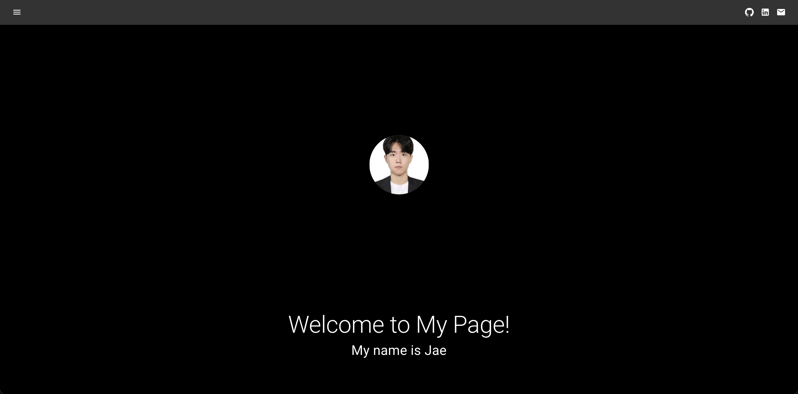

# Jae's Portfolio 👨‍💻

### About Me
I'm Jaehyeok Choi, a **Computer Science** student at the *National University of Singapore*. 

### 🌐 Portfolio Website
> "The best way to predict the future is to create it." - Alan Kay

Check out my website here: [My Portfolio](https://jaechoi.vercel.app/)

📸 Website Preview

*Click to expand and view my portfolio website*

### 🛠️ About This Website
- Built with: **React**, **CSS**, **HTML**
- Deployed on **Vercel**

### 🧭 Navigation
1. Click the menu button (three horizontal lines) on the top left to view the site menu
2. Use the buttons on the top right to access my:
   - GitHub 🐙
   - LinkedIn 💼
   - Email 📧

### 💡 Fun Fact
Did you know? Elon Musk once tweeted that he was considering buying Coca-Cola to "put the cocaine back in."

---

Feel free to explore and get in touch! I'm always open to interesting conversations and collaborations. 🚀